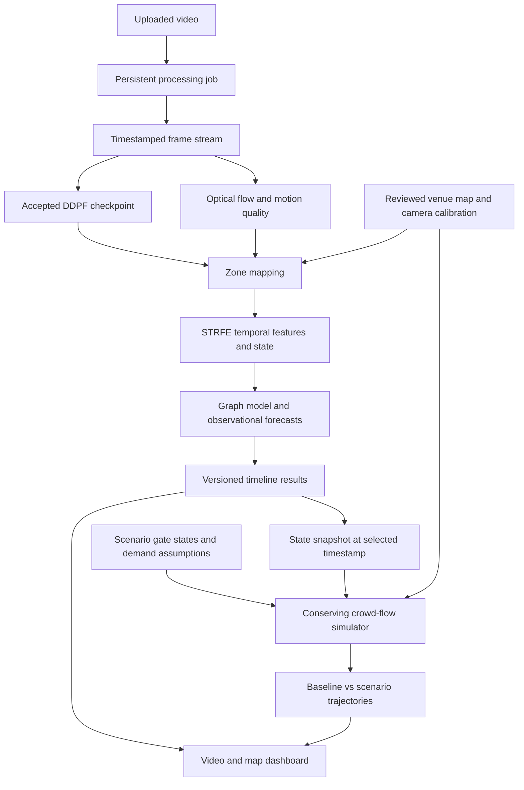

# Beyond Surveillance: from DDPF to a video-driven crowd digital twin

Prepared 6 September 2026. This is an implementation plan; unchecked items are future work, not claims of completed training or validation.

## 1. Intended result

An operator selects a venue and camera, uploads a video, and sees timestamp-aligned crowd estimates and forecasts on a dashboard. The dashboard contains the video, density overlay, venue map, named entrances/exits, zone information, and a timeline. At a selected video timestamp, the operator creates a scenario by opening or closing a gate. The system compares the unchanged baseline against that scenario and shows how occupancy, queues, flows, and congestion may evolve under documented assumptions.

The video remains the recorded observation. Scenario results branch from a selected state; they do not change the uploaded footage or imply that the recorded crowd actually experienced the intervention.

First release scope: one fixed camera, one reviewed venue map, prerecorded video, complete-video processing, short-term forecasting, manual gate interventions, and baseline/scenario comparison. Multi-camera fusion, live CCTV, automated venue extraction, IoT integration, and learned control policies are later extensions.

## 2. Starting point and reuse decision

Your accepted milestone is DDPF complete. We will preserve that milestone and verify its interface before building downstream modules.

The current workspace, `C:\Users\abhij\Documents\ChatGPT\Beyond Surveillance`, contained only `.git` before this plan. An older implementation exists in `C:\Users\abhij\Documents\Beyond Surveillance`. It was inspected read-only for this plan. No application code or checkpoints were copied or changed, and no training or runtime tests were run.

| Component | Evidence inspected in older project | Required decision/work |
|---|---|---|
| DDPF | `crowd_twin/ddpf.py`, density/localization interface | Identify your accepted checkpoint and verify preprocessing, outputs, and provenance. |
| STRFE | `crowd_twin/models/strfe.py`, current/future feature and state outputs | Reuse only after contract and checkpoint tests; retrain if incompatible or inadequate. |
| Graph model | `crowd_twin/models/graph_reasoner.py`, `contracts.py` | Reuse graph handoff ideas; establish forecasting value on held-out scenes. |
| Venue representation | `crowd_twin/venue.py` | Extend polygons and symmetric adjacency with calibrated geometry and explicit directed portals. |
| Video API | `/v1/infer/raw-media` in `crowd_twin/api.py` | Replace capped sample/one-response behavior with persistent full-video jobs and time-indexed results. |
| Scenario model | `crowd_twin/models/digital_twin.py` | Existing learned state deltas are insufficient for dependable gate-flow semantics; add conservation and intervention evidence. |
| Dashboard | `app/page.tsx` | Reuse upload/API structure selectively; implement setup, synchronized playback, gate controls, and scenario comparison. |
| Research evidence | `docs/RESEARCH_MVP_AUDIT.md` | Retain explicit distinctions between pressure proxies, physical measurements, and intervention validation. |

The older documentation reports downstream training, but this plan does not treat those artifacts as verified-current or accepted. In particular, its audit states that physical venue calibration and causal intervention outcomes were unavailable.

## 3. System architecture



There are two forecast products. The observational model predicts continuation from observed history. The intervention engine predicts conditional outcomes under changed topology, gate capacity, and demand. Compare interventions against the same simulator's unchanged baseline; comparing a simulator scenario against an unrelated neural baseline would mix intervention effects with model differences.

Proposed implementation: preserve Python/PyTorch perception and forecasting, FastAPI for contracts and access, a separate worker process for video and simulation jobs, local artifact storage plus SQLite for a single-machine release, and React/TypeScript for the dashboard. Use an SVG venue map initially: polygons, gate segments, labels, arrows, and heat overlays can be directly selected and inspected.

Heavy video computation should run outside the request handler. This choice follows FastAPI's distinction between small background tasks and heavier queued computation; a broker-backed worker can be added when multiple workers are needed. [FastAPI background-task guidance](https://fastapi.tiangolo.com/tutorial/background-tasks/).

## 4. Sequential implementation checklist

Each phase ends with a gate. Record the commit, artifact paths, validation command/report, and remaining limitations before checking it complete. A failed learned-model gate does not prevent a clearly labelled baseline demo, but it prevents claiming that the learned model is an improvement.

### Phase 0 — Establish the authoritative project and freeze DDPF

**Depends on:** your existing DDPF work.

- [ ] Identify the authoritative checkout, branch, DDPF config, weights, and dataset manifests. Reconcile the older project with your accepted work before migrating anything.
- [ ] Inventory reusable source separately from generated outputs, environments, and checkpoints.
- [ ] Record DDPF checkpoint checksum, training datasets, split policy, model architecture, normalization, input resolution, and output resolution.
- [ ] Run DDPF on a known image and a short real video; save predictions and metadata.
- [ ] Verify RGB/BGR ordering, resize/crop transforms, density normalization, and localization coordinate conventions.
- [ ] Verify density integration preserves estimated count across supported resizing and feature resolutions.
- [ ] Establish explicit states for missing, incompatible, fixture, and accepted checkpoints.
- [ ] Record CPU/GPU hardware, memory, dependency lockfiles, and measured inference cost.
- [ ] Choose one representative fixed-camera venue/video as the integration fixture; keep evaluation videos separate.

**Deliverable:** baseline inventory, accepted DDPF manifest, reproducible inference command, sample outputs.

**Gate:** a fresh process reproduces the accepted DDPF output within a recorded numerical tolerance. Missing weights produce an actionable error.

### Phase 1 — Define data contracts and prediction semantics

**Depends on:** Phase 0.

- [ ] Define stable IDs for venue, venue version, camera, calibration, video, processing run, zone, portal, snapshot, and scenario.
- [ ] Store source timestamps, sampled timestamps, frame indices, and actual time deltas. Separate original FPS, analysis sampling rate, UI playback FPS, and simulator time step.
- [ ] Define current estimates, future forecasts, and scenario outputs as distinct record types.
- [ ] Preserve existing state order `[count, density, velocity, acceleration, divergence, congestion, risk]` when using legacy checkpoints; version any semantic or dimensional change.
- [ ] Attach units and availability to every state field. Distinguish image density from people/m² and image motion from m/s.
- [ ] Define missing values and masks; unavailable motion, calibration, or sensors must not silently become confident zero measurements.
- [ ] Define forecast origin time, horizon, target time, and `seconds` versus `normalized_frame_steps` explicitly.
- [ ] Add per-field provenance: visual estimate, calibrated estimate, learned forecast, assumption, or simulation output.
- [ ] Version model/preprocessing/calibration dependencies so cached results are invalidated when any changes.
- [ ] Reject mismatched venue IDs, zone ordering, feature dimensions, and normalization metadata at module boundaries.

**Deliverable:** versioned schemas and minimal valid/invalid example payloads.

**Gate:** the same payload can traverse backend and frontend without losing timestamps, units, zone identity, or evidence type.

### Phase 2 — Build venue setup, entrances/exits, and camera mapping

**Depends on:** Phase 1.

- [ ] Import a floor plan or draw a schematic layout. Record whether its coordinates have a verified physical scale.
- [ ] Draw walkable zone polygons, walls, obstacles, corridors, entrance/exit segments, and camera coverage.
- [ ] Assign each portal a stable ID, name, geometry, source zone, destination zone or outside, allowed direction, width if measured, and baseline open/closed state.
- [ ] Store flow capacity separately from zone occupancy capacity. Gate throughput uses people/second; zone capacity uses people.
- [ ] Represent an entrance and exit as allowed movement directions. A single physical doorway may support both; its shared capacity cannot be independently counted twice.
- [ ] Add explicit upstream/outside queues for arrivals, and outside sinks for departures.
- [ ] Build directed movement edges through actual portals; spatial proximity alone must not connect zones through walls.
- [ ] Keep the model's message-passing adjacency separate from the directed movement/capacity graph. Legacy symmetric adjacency is not a complete routing model.
- [ ] Calibrate fixed-camera ground-plane mapping from well-distributed corresponding landmarks; use more than the minimum four where possible and validate on held-out landmarks.
- [ ] Record scale, reprojection error, valid ground region, distortion correction, and calibration version.
- [ ] Do not map DDPF head points directly as ground contact points. Use a justified ground-position method or reviewed image-zone correspondence, with uncertainty near zone boundaries.
- [ ] Aggregate density in image-space zone masks with count-preserving weighting; a simple warped heatmap can change count mass.
- [ ] Mark unseen zones as unobserved. Request scenario initial-state assumptions for them instead of filling them with zero people.
- [ ] Save/reload venue setups and flag a changed camera view as requiring recalibration.

**Deliverable:** reviewed `venue.json`, portal definitions, camera mapping, coverage masks, and setup screen.

**Gate:** selected visible locations map to the correct zones; all gates have valid endpoints; physical units are shown only when calibrated.

A planar homography is appropriate for a planar surface, not arbitrary three-dimensional points. This is why ground landmarks and head detections need different treatment. [OpenCV homography documentation](https://docs.opencv.org/4.x/d9/dab/tutorial_homography.html).

If no real floor plan is available, deliver a clearly labelled schematic scenario demo. Do not present its assumed gates as recovered facts about the video venue.

### Phase 3 — Process the entire uploaded video

**Depends on:** Phases 1–2; DDPF from Phase 0.

- [ ] Validate file size, supported container/codec, duration, decodeability, and available storage.
- [ ] Create a durable run record immediately; return a job ID rather than waiting for complete inference.
- [ ] Implement job states: queued, running, cancelling, cancelled, failed, completed, and interrupted/recoverable.
- [ ] Stream-decode frames in bounded memory. Do not load the entire video or stop silently after a fixed frame cap.
- [ ] Sample using actual media timestamps; detect discontinuities, variable frame rate, missing frames, and scene cuts.
- [ ] Apply DDPF and cache reusable density/localization/features with preprocessing and checkpoint hashes.
- [ ] Compute motion from distinct adjacent sampled frames; reset temporal history after discontinuities.
- [ ] Store every analysis timestamp through the end of the video, even when an individual frame produces a quality error.
- [ ] Write results incrementally and atomically so a browser refresh does not lose progress.
- [ ] Expose progress, processed duration, total duration, errors, and approximate remaining time when measurable.
- [ ] Add cancellation, resource cleanup, interrupted-job recovery, bounded retries, and a GPU concurrency limit.
- [ ] Preserve the original video and an optional browser-compatible preview with a timestamp mapping.

**Deliverable:** upload-to-timeline processing service, initially showing DDPF outputs only.

**Gate:** a multi-minute video produces results across its full duration; cancellation and browser refresh work; API health remains responsive during processing.

### Phase 4 — Implement motion and zone-state extraction

**Depends on:** Phase 3.

- [ ] Begin with the existing four-channel flow representation: horizontal displacement, vertical displacement, magnitude, and divergence.
- [ ] Record whether flow displacement is per sampled interval; divide by the actual time interval for time-based speed.
- [ ] Correct motion-vector scaling when resizing flow to a different resolution.
- [ ] Add camera-motion quality checks; reject or stabilize moving-camera clips before interpreting image motion as crowd motion.
- [ ] Aggregate density, visual features, and motion into the reviewed zone masks.
- [ ] Retain a direction vector or heading distribution; scalar speed alone cannot support directional routing estimates.
- [ ] Derive acceleration only from valid consecutive velocities with known time intervals.
- [ ] Define congestion/pressure proxies with training-only fitted parameters and named units/scales.
- [ ] If directional entrance/exit crossing counts are needed, add and validate a dedicated tracking/line-crossing or flow-estimation component. DDPF localization alone does not establish trajectories.
- [ ] Mark occlusion, low light, poor localization, unobserved areas, and insufficient history as quality limitations.
- [ ] Mask initial motion and short-history forecasts instead of presenting repeated frames as measured motion.

**Deliverable:** timestamped zone observations and motion-quality diagnostics.

**Gate:** reviewed moving clips show plausible direction and temporal change; still frames do not claim observed movement; invalid physical calibration suppresses physical speed/density units.

### Phase 5 — Train or verify STRFE

**Depends on:** Phase 4 and suitable sequential training data.

- [ ] Build temporal windows with a fixed context duration or explicitly recorded sampling interval.
- [ ] Split by source sequence/camera/venue before generating overlapping windows; keep adjacent windows out of different splits.
- [ ] Freeze accepted DDPF weights initially and cache its outputs for training efficiency.
- [ ] Supply visual features, density/localization, motion, zone masks, and optional masked sensor readings.
- [ ] Reuse or implement short-term ConvLSTM fusion, zone pooling, and long-term temporal reasoning.
- [ ] Record the temporal backend in checkpoints. Do not silently replace Mamba with another backend while describing the experiment as identical.
- [ ] Produce current zone features `[B,N,D]`, current state `[B,N,7]`, and future features/states by horizon.
- [ ] Choose initial horizons from timestamp quality and available sequence length; 5/10/20 seconds are candidate configuration values, not an assumed validated capability.
- [ ] Train only targets supported by data, with masks for missing labels and explicit loss weights.
- [ ] Establish persistence and simple trend baselines on identical examples and horizons.
- [ ] Evaluate count MAE/RMSE, per-zone error, per-horizon error, and failure cases with confidence intervals grouped by sequence.
- [ ] Validate uncertainty intervals separately if supplied; a positive learned uncertainty head alone does not establish calibrated coverage.
- [ ] Save weights, splits, normalization, backend, timestamp convention, and validation report together.

**Deliverable:** reproducible temporal training/inference and a baseline comparison report.

**Gate:** contracts pass on held-out clips. Promote STRFE as the preferred forecast only when it meets predeclared error requirements and improves on the selected baseline; otherwise expose the better baseline and document the result.

### Phase 6 — Add graph-aware forecasting

**Depends on:** Phases 2 and 5.

- [ ] Form graph nodes from zone features and available static venue attributes.
- [ ] Add portal-related connectivity/capacity features and coverage masks without assuming unknown physical values.
- [ ] Validate the existing graph handoff and deterministic zone ordering.
- [ ] Define one authoritative final observational forecast: graph refinement or graph decoding. Keep STRFE outputs available for ablations rather than mixing two forecasts in the UI.
- [ ] Train current state refinement and future zone occupancy where targets exist.
- [ ] If adding ordinal pressure classes, fit their thresholds only on training data and label them as proxy classes.
- [ ] Keep emergency/hazard claims unavailable without corresponding ground-truth outcomes and validation.
- [ ] Compare persistence, STRFE-only, and STRFE-plus-graph using the same splits, horizons, and preprocessing.
- [ ] Test unseen sequences and, when available, unseen cameras/venues; a single-venue test does not establish venue generalization.
- [ ] Check missing-zone behavior, isolated nodes, and robustness to noisy input estimates.
- [ ] Treat attention as a model diagnostic, not proof of causal influence.

**Deliverable:** graph forecast checkpoint or validated baseline fallback, evaluation report, API adapter.

**Gate:** every displayed forecast can be traced to a model, origin timestamp, horizon, and venue version. Improvement claims require measured baseline comparisons.

### Phase 7 — Build a conserving intervention simulator

**Depends on:** Phases 2 and 4. Phase 6 supplies richer initial forecasts, but is not required to test simulator mechanics.

Start with a transparent zone-flow model. A learned twin can follow after intervention datasets exist. This separates learning observational patterns from imposing the actual meaning of a closed gate.

For zone `i`, with rates in people/second:

```text
n_i(t + dt) = n_i(t)
            + dt * (sum_j q_ji(t) - sum_j q_ij(t)
                    + admitted_arrivals_i(t) - departures_i(t))
```

Flows must obey source availability, directed portal capacity, destination receiving space, and shared bottleneck constraints. Clipping negative counts after an unconstrained update is not a substitute for conservation.

- [ ] Represent zone occupancy, directed inter-zone flows, portal service capacity, outside demand/queues, and cumulative exits explicitly.
- [ ] Implement route choice using reachable destinations, travel costs, queues, and configurable route adaptation delay.
- [ ] Define route preferences and demand as assumptions until independently estimated; zone counts alone do not uniquely identify intended destinations.
- [ ] Solve competing outflows jointly so they cannot remove more people than a source contains.
- [ ] Bound inflows by receiving space without deleting rejected arrivals; retain those people upstream.
- [ ] Make closing a portal set its relevant passage capacity to zero while leaving the source zone and its occupants intact.
- [ ] Make opening a portal restore documented/configured capacity, not instantly evacuate its queue.
- [ ] Distinguish closing an entrance from reducing outside demand: denied arrivals accumulate, leave, or reroute according to an explicit model.
- [ ] Recompute reachability when portals change. A disconnected component with people must remain represented.
- [ ] Support intervention start time and optional end time, tied to scenario simulation time.
- [ ] Define behavior for a person/flow already traversing a portal when it closes.
- [ ] Implement both continuous-operation demand and evacuation mode. Finite evacuation time is not meaningful under indefinitely continuing arrivals.
- [ ] Simulate baseline and scenario from the same immutable state, assumptions, horizon, and paired random seeds.
- [ ] Record occupancy, queues, cumulative arrivals/departures, throughput, congestion proxy, and conservation residual per step.
- [ ] Test empty venue, single corridor, split route, shared doorway, all exits closed, disconnected region, overload, and reopen-after-closure.
- [ ] Validate time-step sensitivity and a configured conservation tolerance.

**Deliverable:** deterministic scenario engine, assumption schema, mechanical test suite, saved baseline/scenario trajectories.

**Gate:** closed portals carry zero flow; people are conserved; occupancy is nonnegative; no reachable exit yields an explicit unreachable/not-cleared result, never a fabricated finite clearance time.

Optional later fidelity upgrade: evaluate an agent-based pedestrian engine such as JuPedSim against the venue requirements. This is a separate integration decision, not a prerequisite for the initial zone-flow implementation. [JuPedSim documentation](https://www.jupedsim.org/stable/).

### Phase 8 — Calibrate and validate intervention predictions

**Depends on:** Phase 7 and venue evidence.

- [ ] Collect measured widths, routes, normal gate states, occupancy/flow time series, and entry/exit counts where available.
- [ ] Calibrate flow capacities, route preferences, and movement rates on training/calibration periods only.
- [ ] Validate unchanged-gate simulation on independent time periods before evaluating interventions.
- [ ] Obtain recorded operational changes or suitable controlled observations with known gate timing and demand; do not collect hazardous experiments.
- [ ] Evaluate held-out gate changes separately from unchanged-state prediction.
- [ ] Generate synthetic variation over occupancy, arrivals, topology, bottlenecks, capacities, and action timing for mechanical coverage and optional surrogate training.
- [ ] Label synthetic intervention evidence as simulation evidence; it does not establish real-world causal accuracy.
- [ ] If training a learned twin, condition it on directed edges, gate states, capacities, demand, and action time. Preserve exact closure and conservation through constrained flow outputs or a physical correction layer.
- [ ] Compare a learned surrogate against the calibrated simulator on held-out layouts/actions and measure multi-step drift, not just one-step loss.
- [ ] Run sensitivity sweeps over uncertain initial counts, capacity, arrivals, and route compliance.
- [ ] Report scenario ranges and assumption sensitivity. Distinguish sensitivity ranges from calibrated probabilistic intervals.
- [ ] Define unsupported conditions and mark out-of-range requests accordingly.

**Deliverable:** calibration record, intervention evaluation report, supported operating envelope.

**Gate:** the dashboard may show assumption-based scenarios after Phase 7, but may describe intervention effects as empirically validated only after independent intervention evidence supports that claim. Observational videos alone cannot establish what a previously unobserved closure would cause.

### Phase 9 — Implement persistent APIs and application state

**Depends on:** Phases 1–3 and 7. Forecast endpoints integrate Phase 6 when ready.

Proposed contracts, to reconcile with existing routes during implementation:

| API | Purpose |
|---|---|
| `POST /v1/venues` | Create a reviewed venue version and portals. |
| `POST /v1/venues/{id}/calibrations` | Save camera mapping, quality, and coverage. |
| `POST /v1/videos` | Upload and validate media; return a video ID. |
| `POST /v1/runs` | Queue analysis with explicit video, venue, camera, and model versions. |
| `GET /v1/runs/{id}` | Read progress, status, and structured failure details. |
| `POST /v1/runs/{id}/cancel` | Request bounded cancellation. |
| `GET /v1/runs/{id}/timeline` | Read paginated/time-bounded estimates and forecasts. |
| `GET /v1/runs/{id}/snapshots/{snapshot_id}` | Read an immutable state for comparison. |
| `POST /v1/scenarios` | Create a scenario from a snapshot and explicit portal changes. |
| `GET /v1/scenarios/{id}` | Read status, assumptions, baseline, scenario, and differences. |
| `GET /v1/runs/{id}/export` | Download results and provenance. |

- [ ] Persist videos, runs, snapshots, venue versions, scenarios, and artifact references.
- [ ] Queue heavy work in a separate worker; keep model loading amortized across jobs.
- [ ] Start with progress polling and time-range result reads; add server-sent events only if needed.
- [ ] Use idempotency/deduplication keys to prevent repeated submissions from creating duplicate processing jobs unintentionally.
- [ ] Bind scenario input to an immutable backend snapshot; validate portal IDs, directions, ranges, and schema versions.
- [ ] Return baseline and scenario under the same result schema, including units and simulation provenance.
- [ ] Add bounded pagination, partial-result access, structured errors, and artifact cleanup/retention.
- [ ] Verify incompatible checkpoints/calibrations fail clearly rather than selecting an unrelated default venue.

**Deliverable:** documented API contracts, durable storage, worker, and integration tests.

**Gate:** a saved analysis and scenario survive API restart; cancelling one job leaves others valid; invalid portal/venue combinations are rejected.

### Phase 10 — Build the complete dashboard

**Depends on:** Phases 2, 3, and 9; integrates later model results without replacing the interaction contract.

Operator flow: **Set up venue → Upload video → Process → Review timeline → Select timestamp → Change gates → Compare scenarios → Export.**

- [ ] Build a venue setup view for maps, zones, portals, baseline states, and camera alignment.
- [ ] Show upload/progress/error/cancel states and previously completed runs.
- [ ] Place synchronized video and venue map side by side on desktop.
- [ ] Add video overlays for density, localization, and zone boundaries with independent visibility controls.
- [ ] Render named entrances/exits with state, direction, and selected portal details.
- [ ] Render observed coverage, unobserved areas, occupancy heatmap, and flow arrows with a legend.
- [ ] Provide play/pause/scrub, current video timestamp, and forecast horizon selection.
- [ ] Keep source time, forecast target time, and simulated future time visible and distinct.
- [ ] Display selected-zone count, density/motion when available, forecast, trend, and quality limitations.
- [ ] Let operators choose open/closed state and intervention start/end time; expose optional capacity and arrival assumptions in an advanced panel.
- [ ] Label controls as scenario changes, with Reset, Save scenario, and Run comparison actions. Changes must not silently edit baseline venue configuration.
- [ ] Show baseline and scenario maps with synchronized simulation time and identical color scales.
- [ ] Show absolute values and deltas for maximum occupancy/density, queue size, exit throughput, trapped/unserved population, and clearance where meaningful.
- [ ] Handle zero baseline denominators without misleading percentages; report absolute differences instead.
- [ ] Keep a scenario list so the same snapshot can be compared under several gate configurations.
- [ ] Mark results stale when inputs change and avoid displaying prior scenario outputs as current.
- [ ] Export machine-readable results plus a readable summary of assumptions, source timestamp, and model versions.
- [ ] Provide keyboard-selectable gates, non-color state labels, readable contrast, responsive layouts, and a mobile/tablet fallback.
- [ ] If simulated particles are added, identify them as simulated agents; DDPF points must not be presented as tracked people without tracking evidence.

**Deliverable:** complete interactive application with persistent run/scenario history.

**Gate:** a user can upload, inspect, toggle, compare, and export without editing code; video/map synchronization is within one analysis interval; browser QA covers real outputs, unavailable outputs, errors, and slow jobs.

### Phase 11 — Verify, package, and release the complete local system

**Depends on:** Phases 0–10, with Phase 8 determining the strength of allowed intervention claims.

- [ ] Run the representative video from upload through export in a fresh environment.
- [ ] Verify the first, middle, and final timestamps, including remainder windows and short videos.
- [ ] Re-run boundary tests for timestamps, resizing, masks, schemas, and zone ordering.
- [ ] Verify gate closure, reopening, multiple closures, no reachable exit, and outside queue behavior end to end.
- [ ] Measure count/forecast error on held-out annotations and scenario error on available independent evidence.
- [ ] Measure processing time, effective analysis FPS, peak RAM/VRAM, scenario latency, and browser responsiveness on named hardware.
- [ ] Establish and record product latency targets before optimization; do not claim real-time operation from an offline demo.
- [ ] Test large/corrupt/unsupported media, interrupted workers, missing models, stale calibration, and insufficient disk space.
- [ ] Confirm no test fixtures, demo statistics, or unavailable sensors appear as real run results.
- [ ] Provide reproducible backend/worker/frontend startup, pinned dependencies, model acquisition instructions, and setup troubleshooting.
- [ ] Add local video retention/deletion controls; if exposed beyond a local machine, add authentication, per-run access control, and transport protection before release.
- [ ] Produce an evidence report separating observed performance, model forecasts, assumption-based scenarios, and validated intervention findings.

**Deliverable:** runnable local release, setup guide, demonstration video, evaluation report, known limitations.

**Gate:** another person can reproduce the workflow from the instructions, and every displayed number has a traceable source and correct interpretation.

### Phase 12 — Optional learned policy and broader deployment

**Depends on:** a validated simulator and the completed manually controlled application.

- [ ] Decide whether automatic intervention recommendations are actually needed; manual comparisons already satisfy the requested application.
- [ ] Establish simple candidate enumeration/search baselines before training MAPPO or another policy.
- [ ] Define actions, objectives, hard constraints, and route availability in a reproducible environment.
- [ ] Train on varied simulated venues/demand and evaluate unseen conditions, constraint violations, and sensitivity.
- [ ] Require explicit operator review of recommendations and keep physical gate actuation outside this release.
- [ ] Add multi-camera fusion only after synchronization, coverage overlap, and double-counting are solved.
- [ ] Add live streams with reconnect handling, bounded lag, state recovery, and monitoring.

**Deliverable:** separately evaluated extensions. These must not delay the requested upload-and-scenario system.

## 5. Data required and what each source can support

| Data | Use | Cannot establish alone |
|---|---|---|
| Images with crowd/head annotations | DDPF counts and localization | Temporal forecasts or intervention outcomes |
| Timestamped videos with sequence identity | Motion and temporal/graph training | Physical scale or unseen gate effects |
| Reviewed floor plan and camera landmarks | Zones, entrances/exits, spatial alignment | Gate throughput or pedestrian behavior |
| Gate dimensions and observed directional flow | Capacity calibration | Generalization to all crowd conditions |
| Gate-state logs and independent outcome observations | Intervention evaluation | Universal safety effectiveness |
| Synthetic simulation rollouts | Mechanical tests, scenario coverage, surrogate training | Real-world causal validation |

Without additional labels, retain count/occupancy forecasting and explicitly named pressure proxies. Do not manufacture emergency labels from a visual threshold and then report emergency-detection accuracy.

## 6. Milestones to work through

| Milestone | Phases | Demonstrable result |
|---|---|---|
| M0: Accepted foundation | 0–1 | DDPF and downstream contracts are reproducible. |
| M1: Video-to-map analysis | 2–4 | Entire video appears on a correctly mapped timestamped timeline. |
| M2: Observational prediction | 5–6 | Held-out temporal/graph forecasts with honest baseline comparisons. |
| M3: Gate intervention mechanics | 7 | Gates alter routes/flows while conserving crowd population. |
| M4: Complete user application | 9–10, with Phase 8 evidence status visible | Upload, playback, gate changes, comparison, and export work together. |
| M5: Evaluated release | 8 and 11 | Reproducible application with measured performance and documented limits. |
| M6: Optional research extensions | 12 | Policies/live/multi-camera features evaluated independently. |

Default execution order is Phase 0 through Phase 11. Phase 7 can be developed using validated state fixtures while model training proceeds, and Phase 9 can start with Phase 3, but neither dependency shortcut changes acceptance gates.

For each work item, use this record:

```text
Task ID / phase:
Owner:
Dependencies:
Implementation commit:
Output artifact:
Validation command or manual procedure:
Observed result:
Limitations / follow-up:
Status: not started | in progress | blocked | verified
```

## 7. Planning estimate and first implementation batch

Provisional estimate for one full-time developer with working DDPF, usable videos, and available venue geometry: roughly 9–15 engineering weeks for a research application. This is a scope estimate, not measured project velocity. Reusing verified older code may shorten it; missing annotations, calibration data, GPU resources, or intervention observations can extend it substantially. Real-world intervention validation has a separate data-availability dependency and cannot be promised on that schedule.

| Work package | Provisional effort |
|---|---|
| Reconcile project and contracts | 3–5 working days |
| Venue mapping, video worker, zone states | 8–12 working days |
| STRFE/graph training and evaluation | 10–18 working days plus compute/data turnaround |
| Simulator and scenario API | 8–12 working days |
| Dashboard integration | 8–12 working days |
| End-to-end verification and packaging | 5–8 working days |

The first batch should produce a small end-to-end foundation:

- [ ] Establish the authoritative DDPF checkpoint and checkout.
- [ ] Choose one fixed-camera clip and its map or clearly labelled schematic.
- [ ] Define venue, portal, timestamp, and run schemas.
- [ ] Draw/review the zones and entrance/exit connections.
- [ ] Process the whole clip with DDPF in a persistent worker.
- [ ] Render the real timestamped counts on the map and video timeline.
- [ ] Save the run and verify that it can be reopened after restart.

This is the base on which temporal prediction, graph reasoning, and gate scenarios can be added without rewriting the application's data flow.
